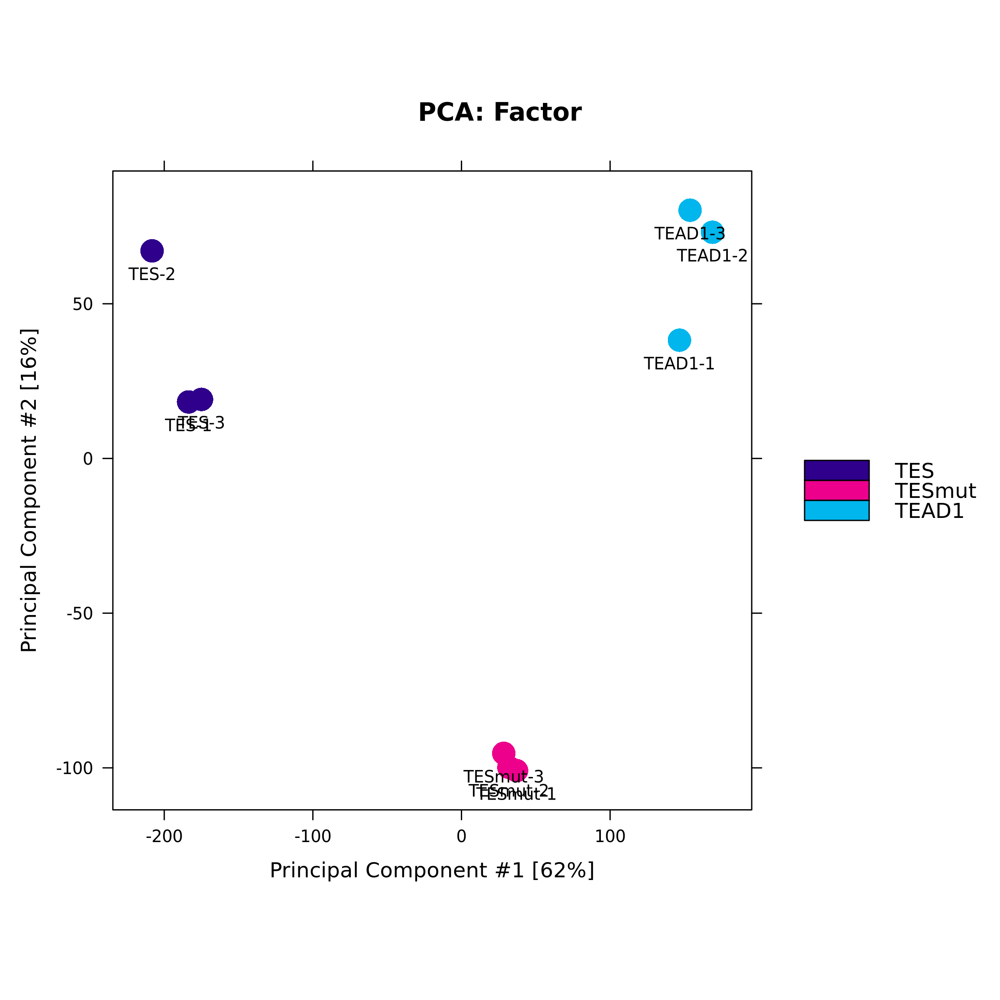
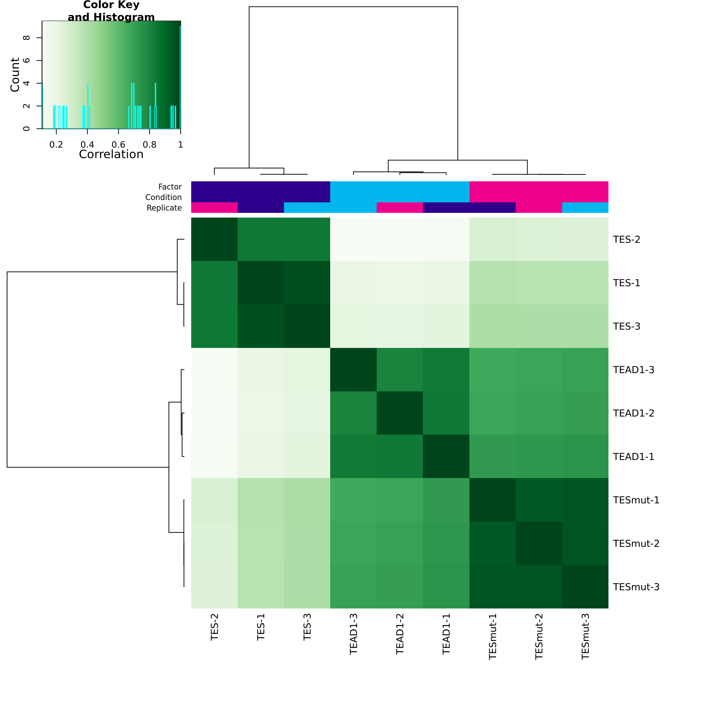

# SRF_Eva Cut&Tag Analysis Pipeline

This directory contains the complete processing and analysis pipeline for Cut&Tag data, investigating the binding profiles of TES and TEAD1 in SNB19 cells.

## Overview

The pipeline processes raw sequencing data through alignment, peak calling, quality control, and advanced downstream analysis. It is designed to:
1.  **Identify Binding Sites**: Call high-confidence peaks for TES and TEAD1.
2.  **Assess Quality**: Evaluate library complexity, fragment size, and replicate reproducibility (IDR).
3.  **Compare Conditions**: Determine differential binding between TES, TEAD1, and controls.
4.  **Integrate Data**: Correlate binding with gene expression and super-enhancer annotations.

## Pipeline Steps

### 1. Preprocessing & Alignment
-   **Scripts**: `1_qc.sh`, `2_adapter_trim.sh`, `3_align.sh`, `4_filter.sh`
-   **Outputs**:
    -   `results/01_fastqc/`: Raw read quality reports.
    -   `results/04_filtered_bam/`: High-quality, deduplicated BAM files.
    -   `results/fragment_analysis/`: Fragment size distributions (`fragment_size_by_sample.pdf`).

### 2. Peak Calling
-   **Scripts**: `5_peak_calling_narrow.sh`, `11_combine_replicates_narrow.sh`
-   **Outputs**:
    -   `results/05_peaks_narrow/`: MACS2 peak calls (`*.narrowPeak`).
    -   `results/11_combined_replicates_narrow/`: Consensus peak sets.
    -   `results/05_peaks_narrow/peak_summary.pdf`: Peak count summary.

### 3. Quality Control & Reproducibility
-   **Scripts**: `multiqc.sh`, `run_additional_analyses.sh` (IDR)
-   **Outputs**:
    -   `results/multiqc/multiqc_report.html`: Aggregate QC report.
    -   `results/idr_analysis/overlap_rates_by_group.pdf`: Replicate consistency.
    -   `results/idr_analysis/correlation_matrix.pdf`: Sample-to-sample correlation.

### 4. Differential Binding Analysis
-   **Scripts**: `9_diff_bind_narrow.sh`, `improved_pipeline.sh`
-   **Outputs**: `results/07_analysis_narrow/`
    -   `DiffBind_PCA.pdf`: Principal Component Analysis of binding profiles.
    -   `DiffBind_correlation.pdf`: Correlation heatmap.
    -   `DiffBind_MA_plots.pdf`: Differential binding scatter plots (TES vs TEAD1).
    -   `DiffBind_venn.pdf`: Overlap of differentially bound sites.

### 5. Annotation & Functional Enrichment
-   **Scripts**: `8_annotate_narrow.sh`, `improved_pipeline.sh`
-   **Outputs**: `results/07_analysis_narrow/enhanced_GO/`
    -   `TES_specific_enhanced_dotplot.pdf`: GO enrichment for TES-specific peaks.
    -   `TES_specific_network.pdf`: Network of enriched pathways.
    -   `*_annotated.csv`: Peaks annotated with nearest genes.

### 6. Super-Enhancer & Cell Death Analysis
-   **Scripts**: `13_ses_overlap.sh`, `cell_death_proliferation_analysis.sh`
-   **Outputs**:
    -   `results/13_ses_overlap/plots/overlap_percentage_barplots.pdf`: Overlap with Super-Enhancers.
    -   `results/cell_death_proliferation/gene_overlap_stats.csv`: Binding at apoptosis genes.

## Generated Outputs

### Quality Control

*Fragment size distribution showing nucleosomal periodicity.*


*Consistency of peak calls across biological replicates.*

### Differential Binding

*Principal Component Analysis showing separation of TES and TEAD1 samples.*


*Clustering of samples based on binding affinity.*

### Functional Analysis

*Network of pathways enriched in TES-specific binding sites.*

## Usage

Run the master script to execute the core pipeline:

```bash
sbatch master_script_narrow.sh
```

For improved analysis and visualizations:

```bash
sbatch improved_pipeline.sh
```

For specific modules (e.g., IDR, Fragment Analysis):

```bash
sbatch run_additional_analyses.sh
```
